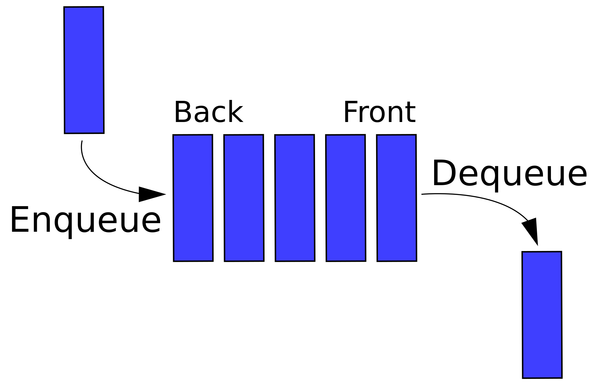

# Level 1 - Queues - Basic Manipulation

<progress value="2" max="9"></progress>

## Introduction

A queue is a list-type abstract data structure that limits interaction with its contents. It can be pictured as a horizontal line of values, where values can **only be added at the back and removed from the front**. A real-life example of a queue is a line of people at the DMV. If anybody cuts in line, the people in the line cut _them_.

  

Queues have an interface with at least two methods:

- `enqueue(value)` - adds a `value` to the "back" of the queue
- `dequeue()` - removes the "front" value from the queue and returns it

Together, these facilitate first-in-first-out (FIFO) operations: the first thing `enqueue`d onto the queue is the first thing that can be `dequeue`d out.

Often, queues include additional helper operations that make them a bit easier to use, such as `peek()`, which returns the "front" value of the queue without removing it.

## Exercise

For this exercise you will be defining several functions that manipulate a queue. You are given a description of each function, a suite of unit tests for each function, and a JavaScript file in which to complete each function definition.

### Getting Started

The `Queue` class is defined in `lib/queue.js`.

The functions you will be implementing are declared in `queues-1.js` and their tests are in `queues-1.test.js`.

Remember to examine the code for the `Queue` class and to read all the tests for a function before you implement it.

### Basic Problems

1. #### `getFront(queue)`

   ##### Parameters

   - `queue` - a `Queue` object containing zero or more values.

   ##### Return Value

   The function should return `undefined` if the `queue` is empty.

   If the `queue` has values, the value at the front of the `queue` should be returned.

1. #### `addToBack(queue, value)`

   ##### Parameters

   - `queue` - a `Queue` object containing zero or more values.
   - `value` - any JavaScript value that can be converted into JSON.

   ##### Return Value

   None (`undefined`).

   ##### Function Affect

   The function should add the provided `value` to the back of the `queue`.

1. #### `takeFront(queue)`

   ##### Parameters

   - `queue` - a `Queue` object containing zero or more values.

   ##### Return Value

   This function should return `undefined` If the `queue` is empty.

   If the `queue` is not empty, this function should return the front `value` in the queue, and remove that `value` from the queue.

1. #### `isEmpty(queue)`

   ##### Parameters

   - `queue` - a `Queue` object containing zero or more values.

   ##### Return Value

   This function should return `true` if the `queue` is empty and `false` if it is not.

## Continue to Level 1 - Linked Lists ➡️

For basic operations on linked lists, proceed to [Level 1 - Linked Lists](../linked-lists).
