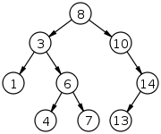

# Binary Search Trees

<progress value="3" max="3"></progress>

## Exercise Overview

A [Binary Search Tree (BST)](https://en.wikipedia.org/wiki/Binary_search_tree) is a data structure that holds its data in a [tree](<https://en.wikipedia.org/wiki/Tree_(data_structure)>), with special rules that allow for quick search and retrieval.

A `tree` holds data in a structure that resembles an upside down tree, with a "root" at the top and children beneath it. Each node in the tree contains the node's value and references to the children beneath it. In the diagram below, each node is represented as a circle with its value inside the circle, and arrows pointing to its children.



In a `Binary Search Tree`, each node can have at most two children (which is where the term "binary" comes from). Also, the values must be orderable (that is, you must be able to compare them and sort them from smallest to largest; for example, numbers or strings). Finally, the nodes are ordered such that every element in the left subtree of any given node must be less than the current node; while every element in the right subtree of a given node must be greater than the current node. Examine the tree in the diagram above and follow all the node references to assure yourself that this tree follows these rules.

With this structure, you can locate any node in the tree by following a "binary search" algorithm. To find a node, start at the root and compare its value to the search node's value. If the search node's value is _less_ than the root node's value, continue the search down the _left_ subtree. If it is _greater_ than the root node's value, continue the search down the _right_ subtree. Then repeat until the value is found or the search ends without finding the value.

The binary search algorithm is [recursive](<https://en.wikipedia.org/wiki/Recursion_(computer_science)>), meaning that the search function calls itself. That is, when continuing down a subtree, the search algorithm is called again but this time with either the left or right child of the current node.

This recursive algorithm works by eliminating half of the remaining values from consideration on each step. Mathematically, such an algorithm is logarithmic, which means that its run time grows as the logarithm of the number of nodes in the tree, and we refer to this as Logarithmic Complexity (or `O(log N)`). Since logarithms grow very slowly, the binary search algorithm is extremely fast (an item in a BST containing a million items can be located in just 20 recursions).

Another major advantage of a BST is that the elements can be easily retrieved in sorted order. While Lists and Hash Tables can be accessed in constant time, they do not maintain their items in sorted order, so they are not appropriate for many algorithms that require sorting. BSTs often come to the rescue when solving such problems.

The net result is that _reading_, _inserting_ and _deleting_ items in a BST are all logarithmic-time operations. (Note that these are all "typical" times. If the BST is unbalanced, with many nodes down one path compared to the others, it can instead give linear times for all these operations.)

### Recursive Algorithms

Operations on BSTs are most easily implemented using recursion. For example, the algorithm for locating a node in a BST involves the search function calling itself. A recursive algorithm will run forever unless it has a termination condition; that is, the algorithm must guarantee that at some point the function does not call itself.

When thinking about recursive algorithms, it is helpful to think about it as repeating each step on a child node and combining the current node value with the value from calling the function with the child. For example, if searching for the largest value in a BST, we would think of it as "find the largest of the current value, the largest value of the left subtree, and the largest value of the right subtree". You might write such code as:

```js
function findMax(node: Node | undefined): number {
  if (!node) return -Infinity;
  return Math.max(node.value, findMax(node.left), findMax(node.right));
}
```

In the above code, the first line in the function is the termination condition. It terminates the recursion if the current node is not defined. This will happen when either `node.left` or `node.right` are undefined. (It returns `-Infinity` since that is guaranteed to be smaller than any other value.) The second line of code returns the max of the 3 values for the current node, the max on the left, and the max on the right.

As a final note, when creating recursive algorithms, it often arises that the public (exported) function interface does not include a parameter for the node. In the example above, rather than exporting the `findMax(node: Node | undefined)` function, it would be more convenient for the caller to instead export a function like `findMax(bst: BinarySearchTree)`. In such cases, it is easiest to create a private (non-exported) function that does the recursion, and calling that from the exported function. This would look something like:

```js
export function findMax(bst: BinarySearchTree | undefined): number {
  return findMaxRecursive(bst.root);
}

function findMaxRecursive(node: Node | undefined): number {
  if (!node) return -Infinity;
  return Math.max(
    node.value,
    findMaxRecursive(node.left),
    findMaxRecursive(node.right)
  );
}
```

## Exercise

For this exercise you will be implementing several functions that search a BST. A BST implementation is provided in `lib/bst.ts`. This file exports two classes, `BinarySearchTree` and `TreeNode`. A `TreeNode` represents a node in the tree, with a value and pointers to its left and right children. You do not need to modify this code, but you may want to look it over to see how it works.

The files `bst-contains.ts`, `bst-smallest.ts`, and `bst-traverse.ts` have been provided, along with corresponding test files. Implement the functions according to the description in their JSDoc comments.

Remember to run the tests (using `npm run test-bst`) to confirm that your solution is correct.

### Tips

- Each of the solutions will be recursive. Remember to create a recursive function, as described above. The algorithm for each recursive function is listed below.
- The recursive algorithm for contains is:
  - If the current node is undefined, return false since an undefined node doesn't contain a value
  - If the current node's value matches the search value, return true
  - Otherwise, if the right child contains the value, return true
  - Finally, if the left child contains the value, return true
- The recursive algorithm for smallest is:
  - If the current node is undefined, return Infinity since an undefined node doesn't have a smallest value
  - Find the smallest value in the node's left subtree
  - Find the smallest value in the node's right subtree
  - Return the smallest of the node's value, the left subtree's smallest value, and the right subtree's smallest value
- The recursive algorithm for traverse is:
  - Visit each of the nodes in the order left-center-right, as follows:
  - Create an empty array to hold the node's values
  - Push all the left subtree's values onto the array (`spread` might be useful)
  - Push the node's value onto the array
  - Push all the right subtree's values onto the array (`spread` might be useful)
  - Return the array of values

## Submitting Your Solution

When your solution is complete, submit a Pull Request on GitHub.

Detailed instructions can be found [**here**](https://lms.learningfuze.com/code-guides/Learning-Fuze/curriculum/Exercise-Workflow_Submitting-Your-Solution).
