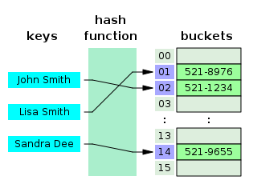

# Hash Tables

<progress value="2" max="3"></progress>

## Exercise Overview

A Hash Table is a data structure that stores data as key/value pairs. You look up an item in a Hash Table using the key, and the Hash Table returns the value.

A Hash Table gets its name from the operation used to look up an item in the table. A Hash Table stores the keys in a list. To locate an item, the key is "hashed", which means that a calculation is performed on it that reduces the key to a number between 0 and the size of the list. This hash value is used as an index into the list to find the item.

A hash table mapping names to phone numbers.

Hash functions (which are used to hash the keys) do not produce a unique index for every key. Sometimes the hash value for two different keys can be the same, which means those two items get stored at the same index. In that case, all keys that hash to the same index must be searched to find the correct one. There are various approaches to minimizing the impact of these collisions. In most common situations, the impact of hash collisions is negligible.

Performance of hash tables for looking up keys is excellent. The hash algorithm is constant time and indexing into a list is constant time, so the overall lookup time is also constant time. With such great performance, why don't we use hash tables for every problem we encounter? One reason is because the order of items in a hash table is unpredictable, so they cannot be used to store sorted data. Another is that they take up extra memory to manage the list of keys and values. Other reasons also limit their use. However, they are a very important and frequently-used data structure. For example, in JavaScript, all objects have their properties and values stored in what is essentially a Hash Table.

The net result is that _reading_, _inserting_ and _deleting_ items in a Hash Table are all constant-time operations. (Note that these are all "typical" times. If there are many hash collisions, a hash table can instead give linear times for all these operations.)

## Exercise Introduction

JavaScript provides a standard built-in Hash Table named [`Map`](https://developer.mozilla.org/en-US/docs/Web/JavaScript/Reference/Global_Objects/Map), which maps keys to values. `Map` is a class with the following behavior:
- Create a new `Map` with `new Map<key_type, value_type>()`, where `key_type` is the data type of the hash table's keys (e.g., `string`), and `value_type` is the data type of the hash table's values (e.g., `Document`).
- Add an item to the `Map` with `Map.set(key, value)`.
- Get an item in the `Map` with `Map.get(key)`.

JavaScript has an additional standard built-in Hash Table named [`Set`](https://developer.mozilla.org/en-US/docs/Web/JavaScript/Reference/Global_Objects/Set), which is similar to an array but guarantees that all values in the `Set` are unique. `Set` uses a Hash Table to guarantee that the values are unique. `Set` is a class with the following behavior:
- Create a new `Set` with `new Set<key_type>()`, where `key_type` is the data type of the set's keys (e.g., `string`).
- Add an item to the `Set` with `Set.add(key)`.
- Check if an item is in the `Set` with `Set.has(key)`.

For this exercise you will use a `Map` and `Set` to implement two steps similar to those used when Google Search processes a query.

### Google Indexing

Google crawls the World Wide Web looking for HTML documents. It creates a huge database of these documents. It then creates a "Document Index", which is a hash table whose key is a word found in one or more documents, and whose value is the set of documents that word appears in.

That is, the index is a Hash Table of:

> `word` maps to `set of documents`; or, in TypeScript, `Map<string, Set<Document>>`

For example, if Google crawled 4 documents with these titles and content:

| Title   | Contents                  |
| ------- | ------------------------- |
| Fish    | About fish.               |
| Fishing | Fish effectively.         |
| Naps    | Nap while fishing.        |
| Supper  | Cook fish while grilling! |

The resulting Document Index would look like:

| Word        | Document Titles |
| ----------- | --------------- |
| about       | Fish            |
| cook        | Supper          |
| effectively | Fishing         |
| fish        | Fish, Supper    |
| fishing     | Naps            |
| grilling    | Supper          |
| nap         | Naps            |
| while       | Naps, Supper    |

The actual Google Document index takes into account word endings (so "fish" and "fishing" would be combined), misspellings, synonyms, and so forth.

### Google Querying

When a user enters a search in the Google website, Google looks up each word in the search query to see if it is found in the Document Index. This produces a list of all the documents in the World Wide Web that match the search.

For example, given the above Document Index, the search query:

> "fish while"

results in the matching documents:

> Fish, Fishing, Naps, Supper

### Google Ranking

Finally, with the list of all the documents that match the search query, Google ranks the documents to find the ones it deems most relevant to the user and presents those as the search results.

Ranking is where the bulk of Google's value is found and is beyond the scope of this exercise. Among other things, Google takes into account the following factors:

- The number of words in the search query that are in the document
- The prominence of words that match the search query
- The document's "Page Rank" (which is a measure of how many other documents across the web have links back to this document)
- The user's prior search history, demographic, interests, and other factors Google can learn about the user based on data the user has agreed to share with Google

## Exercise

For this exercise, you will use a `Map` and a `Set` to implement a simplistic Document Index and Search Query.

### Document Index

The file `map-index.ts` defines `Document` and `DocumentIndex` types, along with a function skeleton for building a `DocumentIndex` given an array of `Document`s. Complete the implementation of `buildIndex()` to create the document index as described above.

The file `map-index.test.ts` contains tests that will test your implementation.

#### Tips

- You can split the document content into words with `String.match(/\b(\w+)\b/g)`, which returns an array of words.
- Remember to convert words to lower case before adding them to the index.
- You can create an empty `DocumentIndex` with `new Map<string, Set<Document>>()`.
- You will want to create the index, then loop through each `Document` and find all the words in that `Document`. Then loop through each word in the `Document` and add it to the `DocumentIndex`.
- Note that when adding a word to the `DocumentIndex`, if the word is _already_ in the index then its value will contain a `Set`. You need to add the current document to that `Set`.
- The algorithm for building the index is:
   - Create the `DocumentIndex`, then loop through each `Document`.
   - For each document, find all the words in that document and loop through the words. For each word:
      - First check to see if the word is in the document index and retrieve its document set.
      - If the word is present, add the current document to its document set.
      - If the word is not present, create a new `Set` and add the current document to it.
      - Then add the word and document set to the document index.
   - Return the document index.

### Search Query

The file `map-query.ts` has a function skeleton for searching a `DocumentIndex` to find `Document`s that match a query. Complete the implementation of `queryIndex()` to find matching `Document`s, as described above. You will need to split the query string into words and find the documents that contain one or more of the words.

The file `map-index.test.ts` contains tests that will test your implementation.

#### Tips

- You can split the query string into words with `String.match(/\b(\w+)\b/g)`, which returns an array of words.
- Remember to convert words to lower case before looking them up in the index.
- The algorithm for querying the index is:
   - Create the result `Set`, then loop through the words in the query. For each word:
      - Look up the word in the `DocumentIndex`.
      - If the word is present, loop through each `Document` in its document set and add it to the result.
   - Return the result set.

## Continue to Binary Search Trees ➡️

For more practice using data structures, proceed to [Binary Search Trees](bsts.md).
