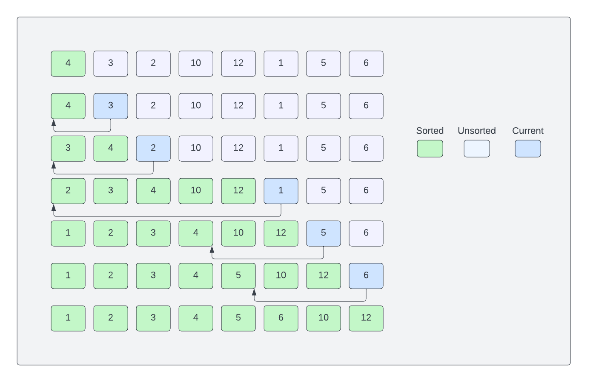

# Insertion Sort Algorithm

Insertion sort is similar to how you would sort playing cards. You start with an empty left hand and the cards face down on the table. Then you remove one card at a time from the table and insert it into the correct position in the left hand. To find the correct position for a card, you compare it with each of the cards already in the hand. At all times, the cards held in the left hand are sorted.

An array is split into two parts: `sorted` and `unsorted`. Initially, the sorted part just has one element (the first element). Then, we pick an element from the unsorted part and insert it into the sorted part at the correct position. We do this until the unsorted part becomes empty.

Let's look at an example:



```text
[4, 3, 2, 10, 12, 1, 5, 6]
```

The first element is already sorted. So, we pick the second element (3) and compare it with the first element (4). Since 3 is smaller than 4, we swap them. Now, the first two elements are sorted.

```text
[3, 4, 2, 10, 12, 1, 5, 6]
```

Next, we pick the third element (2) and compare it with the first element (3). Since 2 is smaller than 3, we swap them. Then, we compare 2 with 4 and swap them. Now, the first three elements are sorted.

```text
[2, 3, 4, 10, 12, 1, 5, 6]
```

We continue this process until the unsorted part becomes empty.

### Complexity & Efficiency

- Worst-case time complexity: O(n^2)
- Best-case time complexity: O(n^2)
- Average-case time complexity: O(n^2)
- Space complexity: O(1)

Compared to a bubble sort, insertion sort requires less number of swaps, so it is slightly more efficient, especially when the array is partially sorted. However, it still has a time complexity of O(n<sup>2</sup>) because we still have to compare each element with all the other elements in the sorted part.

_Online Sorting_: Insertion sort is well-suited for "online" sorting, where new elements are continuously added to a sorted list. It efficiently adds new elements to the sorted portion, while something like selection sort, which we'll look at next, requires a full traversal of the unsorted portion for each new element.

In the next lesson, we will implement insertion sort in TypeScript.
