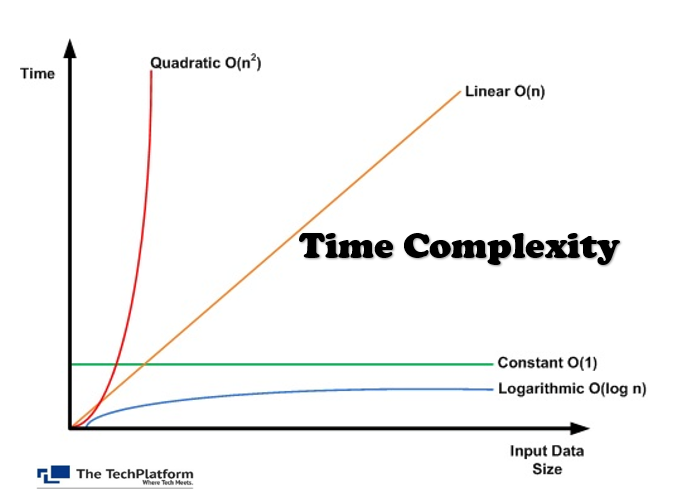

# Quadratic Time Complexity `O(n^2)`

Quadratic time complexity is when the runtime scales quadratically with the input. As the input size increases, the runtime of the algorithm also increases in a quadratic fashion (i.e. the runtime is proportional to the square of the input size). So if the input size is 1, the runtime is 1 step. If the input size is 10, the runtime is 100 steps. If the input size is 100, the runtime is 10,000 steps. And so on.

This behavior is denoted by Big O notation as O(n^2) or "O of n squared", where n represents the size of the input.

Let's look at an example of a quadratic time O(n^2) function.

```js
function sumArray(arr: number[]): number {
  let sum = 0;
  let sum2 = 0;
  for (let i = 0; i < arr.length; i++) {
    sum += arr[i];
    for (let j = 0; j < arr.length; j++) {
      sum2 += arr[j];
    }
  }
  return sum + sum2;
}
```

In the given example, we have a function called `sumArray` that calculates the sum of all elements in an array. However, this implementation exhibits quadratic time complexity (O(n^2)) due to the presence of nested loops.

The outer loop iterates over each element of the input array once, while the inner loop iterates over the array again for each outer loop iteration. As a result, for every element encountered in the outer loop, the inner loop iterates over the entire array.

This leads to a significant increase in the number of operations performed as the input size grows. For an array of length n, the number of total operations becomes roughly proportional to n \* n, resulting in a quadratic relationship between the input size and the runtime.

Due to the nested loops, the time required to execute the `sumArray` function increases exponentially with the input size. As the array becomes larger, the execution time grows much faster, making it inefficient for larger inputs.

We can see this by looking at our chart:



So in general, quadratic time complexity is not very efficient. However, there are some cases where it is the best or the only solution.

You can test the runtime on your machine by running the following code:

```js
function sumArray(arr: number[]): number {
  let sum = 0;
  let sum2 = 0;
  for (let i = 0; i < arr.length; i++) {
    sum += arr[i];
    for (let j = 0; j < arr.length; j++) {
      sum2 += arr[j];
    }
  }
  return sum + sum2;
}

const arr1 = [1, 2, 3, 4, 5];
console.time("Sum Array 1");
sumArray(arr1);
console.timeEnd("Sum Array 1");

const arr2 = Array.from({ length: 10000000 }, (_, index) => index + 1);

console.time("Sum Array 2");
sumArray(arr2);
console.timeEnd("Sum Array 2");
```

You may have to kill `ts-node-esm` because it will take a long time to run `Sum Array 2`.
